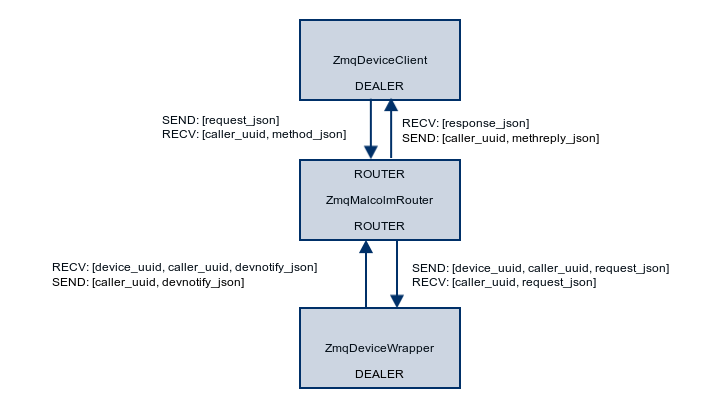

.. highlight:: javascript
.. module:: malcolm.zmqComms

JSON over ZeroMQ
================

This is the simplest protocol, using JSON encoded strings which are sent over
ZeroMQ sockets. An implementation is supplied in the :module:`zmqComms` module.

There are 3 roles supported by the zmqComms module, illustrated by the diagram
below:

ZmqDeviceClient
---------------
This role is fulfilled by the :class:`ZmqDeviceClient` class as well as the ???
Java class. It is responsible for interacting with a named malcolm device,
providing methods for the client to:

- call methods, either just returning the return code, or returning an iterator
  that can gives intermediate status updates
- get parameters, from the entire structure of the device down to individually
  named fields
- subscribe to changes in named parameters

It does this by:

- serializing the `request_json`_
- sending them over a ZeroMQ DEALER that is connected to the
  `ZmqMalcolmRouter`_ device facing socket
- listening for replies over that same socket
- deserializing the `response_json`_
- yielding status updates, returning values and raising errors as appropriate

Each client should make sure that it sends data at least once every 10 seconds.
This keeps the TCP connection alive and verifies that both the client and
router are still alive. A malcolm.ping() method is provided for this purpose.

ZmqMalcolmRouter
----------------
This role is fulfilled by the :class:`ZmqMalcolmRouter` class. It is responsible
for routing `ZmqDeviceClient`_ requests to the correct `ZmqDeviceWrapper`_, and
routing the responses back again. It also has some general methods that allow
the client to query the currently available devices. It does this by using two
sockets, a client facing ZeroMQ ROUTER socket and a device facing ZeroMQ ROUTER
socket.

The client facing socket:

- deserializes the `request_json`_
- if it is a general method, then it acts on it and returns the correct `response_json`_
- if it is for a registered device, then it routes it the to correct `ZmqDeviceWrapper`_
- otherwise it returns an `error_json`_

The device facing socket:

- deserializes the `devnotify_json`_
- if it is a `ready_json`_ then register the device as one of the currently registered
  devices
- if it is a `response_json`_ then route it back to the correct `ZmqDeviceClient`_

It also makes sure that both the clients and devices produce data once every 10 seconds,
marking them as disconnected and informing the interested parties if so.

ZmqDeviceWrapper
----------------
This role is fulfilled by the :class:`ZmqDeviceWrapper` class. It is responsible
for translating `ZmqDeviceClient`_ requests into :class:`malcolm.core.Device`
function calls, returning the relevant status updates, return codes and error
messages. It does this by:

- sending a `ready_json`_ using a ZeroMQ DEALER socket that is connected to the
  `ZmqMalcolmRouter`_ device facing socket
- waiting for `request_json`_, deserializing it when it arrives
- if it is a `get_json`_ then serializing the requested parameter and sending it back
- if it is a `call_json`_ then calling the requested method, sending `value_json`_
  for status updates, `return_json`_ if a function returns normally, and
  `error_json`_ if it raises an error

request_json
------------
Can be one of:

- `call_json`_ to call a method of a device
- `get_json`_ to get a parameter of a device

devnotify_json
--------------
Can be one of:

- `ready_json`_ for a notifications of newly connected devices
- `response_json`_ for device responses to client requests

response_json
-------------
Can be one of:

- `value_json`_ for status updates during a function
- `return_json`_ for return values (including None)
- `error_json`_ for raised errors

call_json
---------
- type = "Call"
- id = ``<int id to appear in responses>``
- method = ``<name of device>.<name of method>``
- args (optional)

  - ``<arg1name>`` = ``<arg1value>``
  - ``<arg2name>`` = ``<arg2value>``

.. container:: toggle

    .. container:: header

        **Example**: Call ``zebra.configure(PC_BIT_CAP=1, PC_TSPRE="ms")``:

    .. code-block:: javascript
    
        {
          "args": {
            "PC_BIT_CAP": 1, 
            "PC_TSPRE": "ms"
          }, 
          "type": "Call", 
          "method": "zebra1.configure", 
          "id": 0
        }

.. container:: toggle

    .. container:: header

        **Example**: Get the list of all available device names:

    .. code-block:: javascript

        {
          "type": "Call", 
          "method": "malcolm.devices", 
          "id": 0
        }

get_json
--------
- type = "Get"
- id = ``<int id to appear in responses>``
- param = ``<name of device>`` or ``<name of device>.<name of method>``

.. container:: toggle

    .. container:: header

        **Example**: Get the last status message from zebra:

    .. code-block:: javascript
    
        {
          "type": "Get", 
          "id": 0, 
          "param": "zebra1.status"
        }

.. container:: toggle

    .. container:: header

        **Example**: Get the entire "zebra1" structure:
        
    .. code-block:: javascript
    
        {
          "type": "Get", 
          "id": 0, 
          "param": "zebra1"
        }

ready_json
----------
- type = "Ready"
- device = ``<name of device>``

.. container:: toggle

    .. container:: header

        **Example**: A signal from "zebra1" saying it's ready:

    .. code-block:: javascript
    
        {
          "device": "zebra1", 
          "type": "Ready"
        }
    
value_json
----------
- type = "Value"
- id = ``<int id in response to>``
- val = ``<status update structure>``

.. container:: toggle

    .. container:: header

        **Example**: A status update from zebra1:

    .. code-block:: javascript
    
        {
          "type": "Value",
          "id": 0,
          "val": {
            "timeStamp": {
              "nanoseconds": 853468894,
              "userTag": 0,
              "secondsPastEpoch": 1437663079
            },
            "state": {
              "index": 2,
              "choices": [
                "Fault",
                "Idle",
                "Configuring",
                "Ready",
                "Running",
                "Pausing",
                "Paused",
                "Aborting",
                "Aborted",
                "Resetting"
              ]
            },
            "message": "Configuring..."
          }
        }

return_json
-----------
- type = "Return"
- id = ``<int id in response to>``
- val = ``<return value structure>``

.. container:: toggle

    .. container:: header

        **Example**: Getting the last status message from "zebra1":

    .. code-block:: javascript
    
        {
          "type": "Return", 
          "id": 0, 
          "val": {
            "timeStamp": {
              "nanoseconds": 853468894, 
              "userTag": 0, 
              "secondsPastEpoch": 1437663079
            }, 
            "state": {
              "index": 1, 
              "choices": [
                "Fault", 
                "Idle", 
                "Configuring", 
                "Ready", 
                "Running", 
                "Pausing", 
                "Paused", 
                "Aborting", 
                "Aborted", 
                "Resetting"
              ]
            }, 
            "message": "message"
          }
        }

.. container:: toggle

    .. container:: header

        **Example**: Getting the entire "zebra1" structure:

    .. code-block:: javascript
    
        {
          "type": "Return", 
          "id": 0, 
          "val": {
            "status": {
              "timeStamp": {
                "nanoseconds": 853468894, 
                "userTag": 0, 
                "secondsPastEpoch": 1437663079
              }, 
              "state": {
                "index": 2, 
                "choices": [
                  "Fault", 
                  "Idle", 
                  "Configuring", 
                  "Ready", 
                  "Running", 
                  "Pausing", 
                  "Paused", 
                  "Aborting", 
                  "Aborted", 
                  "Resetting"
                ]
              }, 
              "message": "Configuring..."
            }, 
            "attributes": {
              "PC_BIT_CAP": {
                "tags": [
                  "configure"
                ], 
                "timeStamp": {
                  "nanoseconds": 118811130, 
                  "userTag": 0, 
                  "secondsPastEpoch": 1437663842
                }, 
                "alarm": {
                  "status": 0, 
                  "message": "No alarm", 
                  "severity": 0
                }, 
                "value": 5, 
                "descriptor": "Which encoders to capture", 
                "type": "int"
              }, 
              "CONNECTED": {
                "descriptor": "Is zebra connected", 
                "alarm": {
                  "status": 1, 
                  "message": "Communication problem", 
                  "severity": 3
                }, 
                "type": "int", 
                "value": 0, 
                "timeStamp": {
                  "nanoseconds": 118811130, 
                  "userTag": 0, 
                  "secondsPastEpoch": 1437663842
                }
              }, 
              "PC_TSPRE": {
                "tags": [
                  "configure"
                ], 
                "timeStamp": {
                  "nanoseconds": 118811130, 
                  "userTag": 0, 
                  "secondsPastEpoch": 1437663842
                }, 
                "alarm": {
                  "status": 0, 
                  "message": "No alarm", 
                  "severity": 0
                }, 
                "value": "ms", 
                "descriptor": "What time units for capture", 
                "type": "str"
              }
            }, 
            "methods": {
              "run": {
                "descriptor": "Start a scan running", 
                "args": {}, 
                "valid_states": [
                  "Ready", 
                  "Paused"
                ]
              }, 
              "configure": {
                "descriptor": "Configure the device", 
                "args": {
                  "PC_BIT_CAP": {
                    "descriptor": "Which encoders to capture", 
                    "type": "int", 
                    "value": null, 
                    "tags": [
                      "required"
                    ]
                  }, 
                  "PC_TSPRE": {
                    "descriptor": "What time units for capture", 
                    "type": "str", 
                    "value": "ms"
                  }
                }, 
                "valid_states": [
                  "Idle", 
                  "Ready"
                ]
              }
            }
          }
        }

error_json
----------
- type = "Return"
- id = ``<int id in response to>``
- message = ``<error message>``

.. container:: toggle

    .. container:: header

        **Example**: Trying to call a function on a non-existant device "foo":

    .. code-block:: javascript
    
        {
          "message": "No device named foo registered", 
          "type": "Error", 
          "id": 0
        }
